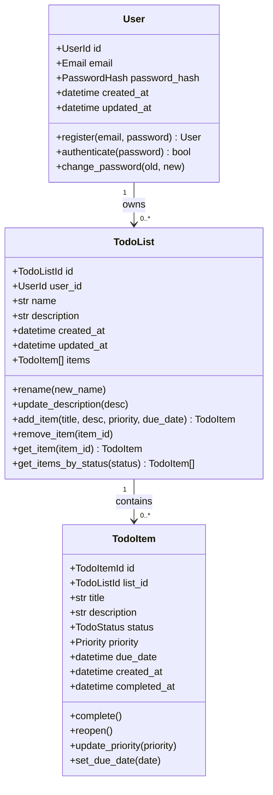

```mermaid
classDiagram
class User {
        +UserId id
        +Email email
        +PasswordHash password_hash
        +datetime created_at
        +datetime updated_at
        +register(email, password) User
        +authenticate(password) bool
        +change_password(old, new)
    }
    class TodoList {
        +TodoListId id
        +UserId user_id
        +str name
        +str description
        +datetime created_at
        +datetime updated_at
        +TodoItem[] items
        +rename(new_name)
        +update_description(desc)
        +add_item(title, desc, priority, due_date) TodoItem
        +remove_item(item_id)
        +get_item(item_id) TodoItem
        +get_items_by_status(status) TodoItem[]
    }
    class TodoItem {
        +TodoItemId id
        +TodoListId list_id
        +str title
        +str description
        +TodoStatus status
        +Priority priority
        +datetime due_date
        +datetime created_at
        +datetime completed_at
        +complete()
        +reopen()
        +update_priority(priority)
        +set_due_date(date)
    }
    User "1" --> "0..*" TodoList : owns
    TodoList "1" --> "0..*" TodoItem : contains
```